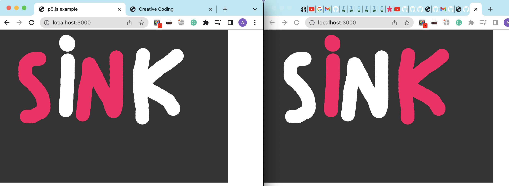
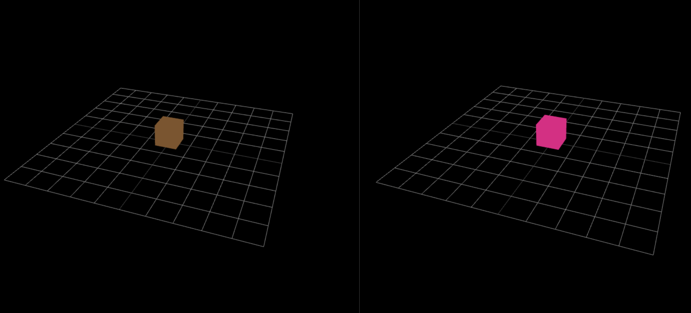
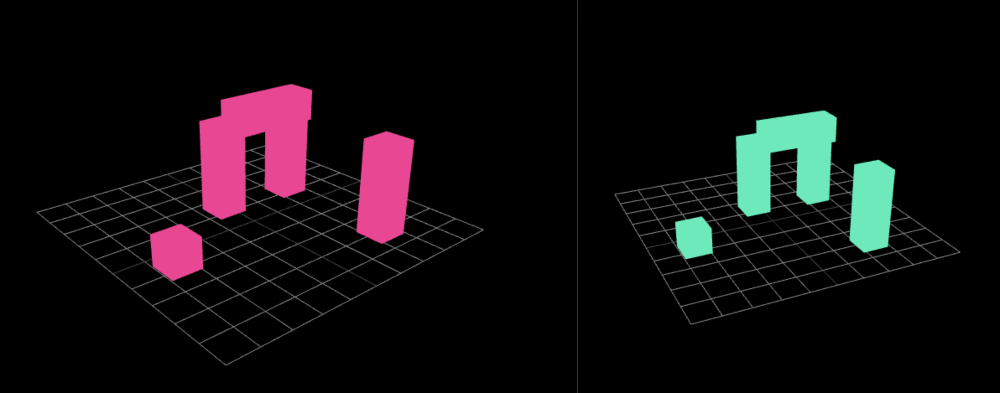
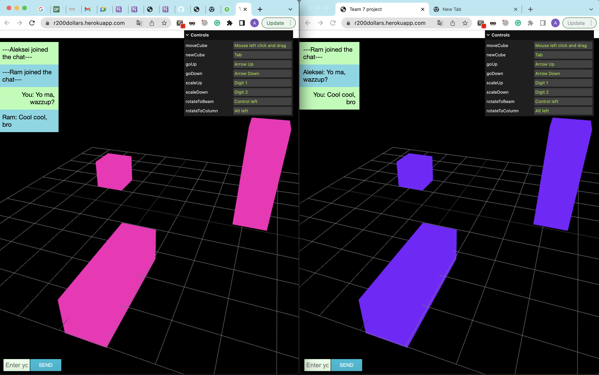

Here Ram and Aleksei will show their results regarding **Real-time collaboration challenge.**

Our [Github repo](https://github.com/alekseikondratenko/Collaborative-drawing)

You can start playing [here](https://r200dollars.herokuapp.com/). **Please navigate to 'instructions' heading before the start of the game.**

## Project idea

The AEC industry has a lack of development, digitalization, and collaboration. Even though recent BIM developments allowed users to exchange models and data, it is still far from real-time collaboration. Using videogames terminology, we would like to change how people design buildings from step-based strategy (like XCOM) to real-time strategy (RTS, like StarCraft). Our project is the first step towards this goal. Here, you can collaboratively move objects in space, change their scale, rotate them, and create new ones also having the opportunity to chat. Even though, it is a raw prototype, we believe it makes clear an idea of real-time collaboration and its value during the building’s design stage.

## Instructions and limitations

- fsf
- d

## Project development

### Step 1

We completed 2 cources related to p5js, nodejs, express and socket.io.

The results of the step 1 was the real-time updated canvas taken from one of the cources

### Step 2

We connected three.js canvas to the initial prototype and made it work for all the clients using socket.io

### Step 3

We made our objects connected for each client in terms of their position, scale and shape. Also, it is possible to add additional cube pressing a button on a keybord. In addition, we added 'controls' to help user to play our game.

### Step 4

We added a chat to our game and deployed it to Heroku.

